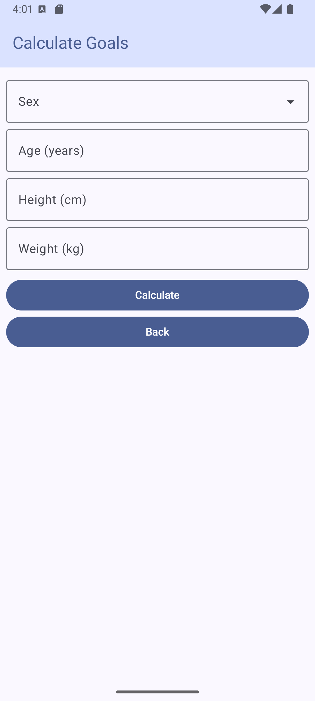

# Fitness Tracker

A simple fitness tracking app made for Android using Kotlin.

## Usage

1. Ensure proper tools like Java, Kotlin, and Android Studio are installed.
2. Open the project folder in Android Studio.
3. Click the play button on top right.
4. Enjoy interacting with the app.

## Examples

