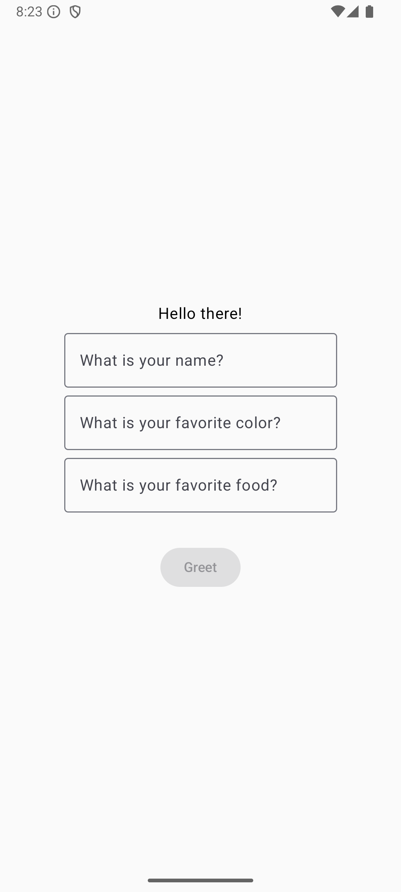

# Module 1
A simple Android app made in Kotlin. The app has a simple interface with three questions to greet the user.

## Usage
1. Ensure proper tools like Java, Kotlin, and Android Studio are installed. 
2. Open the project folder in Android Studio.
3. Click the play button on top right.
4. Enjoy interacting with the app.

## Examples

